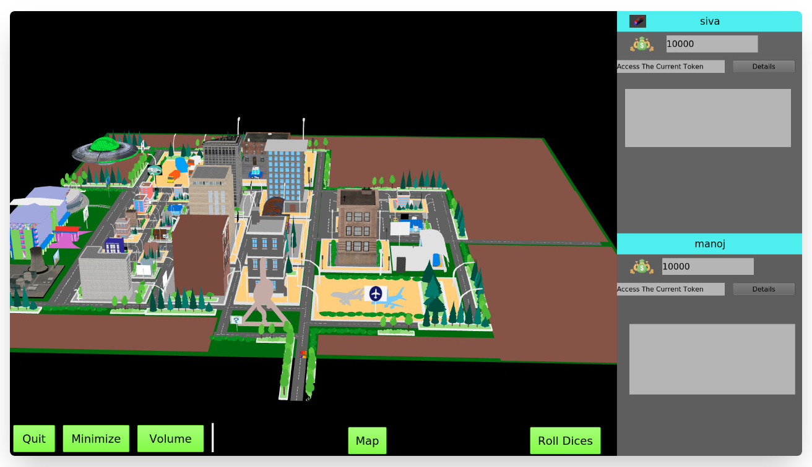
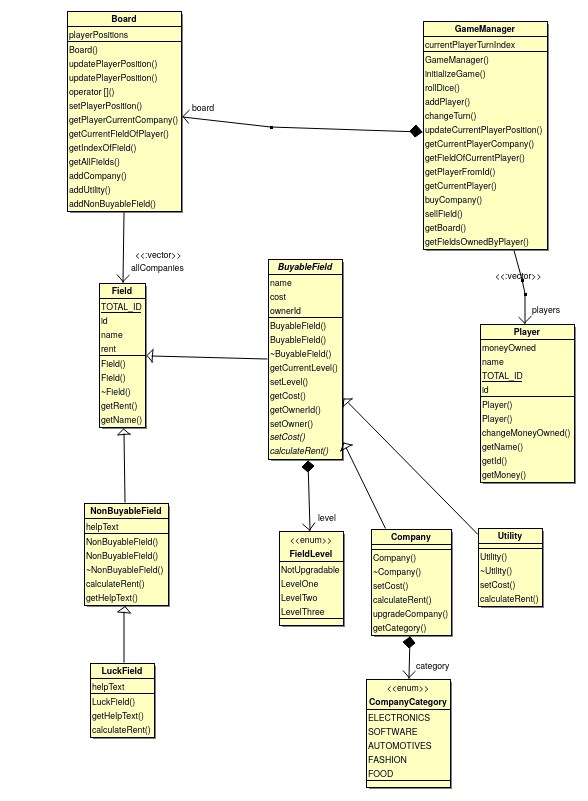

# monopoly-with-a-twist

A 3D game built with using QT and C++.

Unlike the tradional Monopoly, which is played with cities on a board, the game here involves a 3D city, which houses companies spread across the city.
The players travel in a car (akin to moving around the board) and invest in companies, buy them etc.

The core of the game, the logic that controls the game, is written in C++, and is modelled following an **object-oriented approach** while the frontend is written with QT.

### UML

The diagram below depicts the classes used in core that controls the logic
of the game.

### Running a local development version

1. Install QT Creator
   Can be downloaded from QT's site  [here](https://www.qt.io/download)

2. Open the UI/UI.pro app QT Creator.

It is also possible to use the qmakefile and compile and run from the commandline, but using QT Creator makes the development easier.

### Disclaimer

The names, logos and images used in the project are the copyrights of their respective owners.
